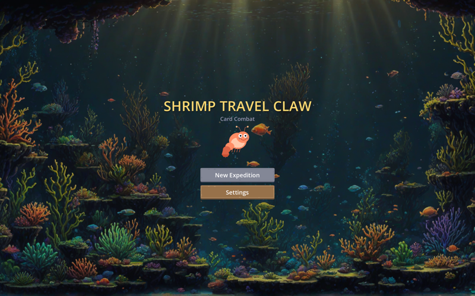
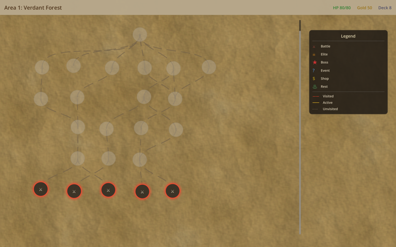
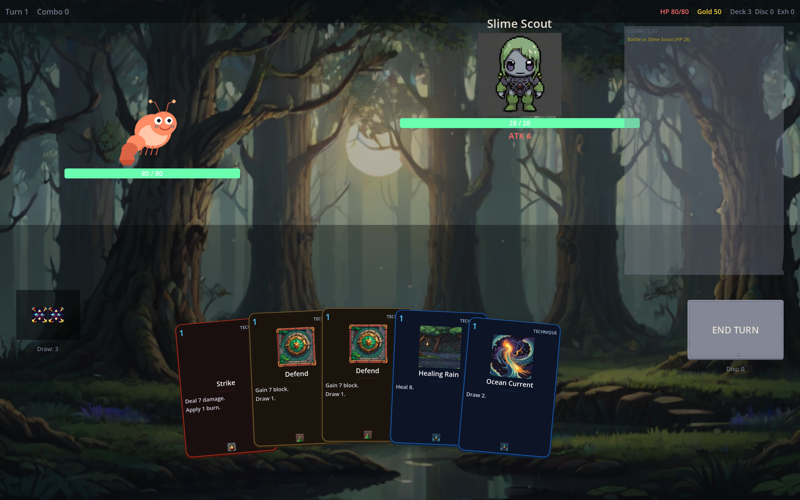
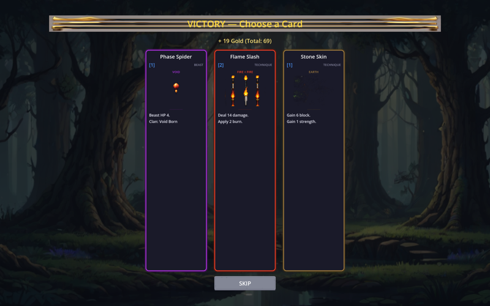

# Claw Card

A cozy card combat roguelike built with Godot 4.6 and GDScript.

Slay the Spire meets claw machine — collect shrimp companions, build decks with elemental synergies, and travel through a deep-sea world.

## Screenshots

| Title | Map | Battle | Rewards |
|-------|-----|--------|---------|
|  |  |  |  |

## Features

- **60 cards** across 5 elements (fire, water, earth, lightning, void) and 3 types (technique, beast, artifact)
- **Beast companions** that fight alongside you with clan synergies
- **Roguelike expedition** — branching map with battles, elites, events, shops, rest sites, and bosses
- **3 areas** — Verdant Forest, Crystal Mountain, Inferno Volcano
- **Element combos** — chain cards of matching elements for bonus effects
- **Data-driven** — all cards, enemies, and balance params defined in JSON

## Run

Requires [Godot 4.6+](https://godotengine.org/download/).

```bash
# CLI (no editor needed)
godot --path .

# Or open in Godot editor
godot --editor --path .
```

## Project Structure

```
├── assets/
│   ├── sprites/          # Character, card, and background art (AI-generated)
│   └── ui/               # Kenney UI assets (CC0)
├── data/
│   ├── cards.json        # 60 card definitions
│   ├── enemies.json      # 10 enemy types with intent AI
│   ├── areas.json        # 3 expedition areas
│   ├── synergies.json    # Clan bonus system
│   └── params.json       # Balance constants (RL-tunable)
├── scenes/               # Godot scene files (.tscn)
├── scripts/
│   ├── autoloads/        # Singletons (GameData, GameManager, etc.)
│   ├── engine/           # Battle engine + state (pure logic, no UI)
│   ├── models/           # CardData, EnemyData, BattleState
│   └── ui/               # All UI scripts (battle, map, cards, menus)
└── project.godot
```

## Card System

Cards have:
- **Energy cost** (0-3)
- **Elements** (fire, water, earth, lightning, void)
- **Type** (technique, beast, artifact)
- **Effects** — damage, block, draw, heal, burn, poison, weak, vulnerable, strength
- **Keywords** — exhaust, chain, retain, innate

Beasts are persistent companions summoned from beast cards. They occupy beast slots and trigger effects based on clan synergies.

## Tech

- **Engine**: Godot 4.6, GDScript
- **Art**: AI-generated (DreamShaper XL on RTX 4090)
- **UI assets**: [Kenney](https://kenney.nl/) (CC0)
- **Architecture**: Data-driven cards via JSON, battle engine separated from UI
- **Balance**: Python test suite (126 tests) + RL-tunable parameters

## License

MIT — see [LICENSE](LICENSE).

Art assets are AI-generated and included under the same MIT license.
Kenney UI assets are CC0 (public domain).
